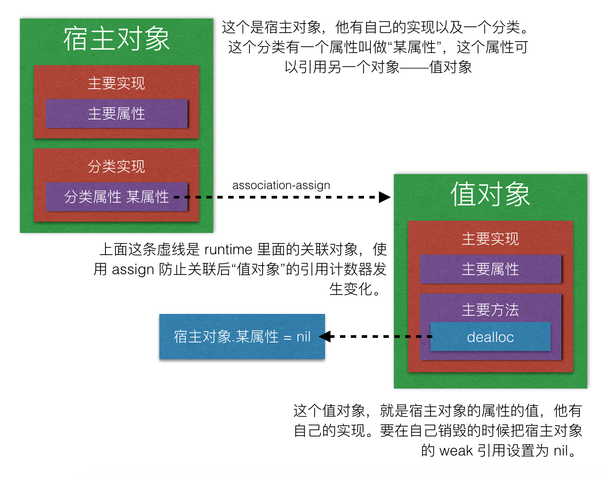

# 如何使用 Runtime 给现有的类添加 weak 属性

Magic-Unique 冷秋

[TOC]

## 事先说好
​	前不久看到 [@sunnyxx](http://weibo.com/p/1005051364395395) 想找一个性取向正常的实习生帮他分担一点工作量，当想起他和 [@ibireme]( http://weibo.com/ibireme) 秀的亲密自拍后我就知道事情并没有这么简单→_→。但是作为性取向正常的我还是比较关心滴滴的招人水准，于是我便想起了之前他发的一份[面试题](http://blog.sunnyxx.com/2015/07/04/ios-interview/)，其中有一题就是**如何使用Runtime实现weak属性**。在那之后 [@iOS程序犭袁](http://weibo.com/luohanchenyilong) 整理了一份有关这一份面试题的 [参考答案](https://github.com/ChenYilong/iOSInterviewQuestions/blob/master/01《招聘一个靠谱的iOS》面试题参考答案/《招聘一个靠谱的iOS》面试题参考答案（上）.md)，也包括了这个题目。
​	看了整理的答案后觉得方法妥当，唯一不足的是不够严谨。于是我自己学习答案上的思维后修补了一些不足之处。如有大神觉得可以改进的地方望不吝指出~。

​	前方高能预警！！！！老司机要开车了！！请站稳坐稳手扶好。。。

​	这是一篇“我认为是一个很复杂的”文章。虽说复杂，但是涉及的都是OC基础知识。文章前面会介绍一下涉及点，后面是分析需求、定制方案以及具体实现。如果看不懂的话仅仅了解文章前面的一些基础知识点也是不错滴（也可能是我写的不够好。。。新手写文章请轻喷）。

## 涉及点——weak & assign

​	很多公司面试时候经常用这个作为面试题：weak 和 assign 有什么区别？

​	这个问题在本文中非常重要，因为 runtime 中`association_policy`中所提供的只有 `assign` 却没有 `weak`。相比于别的修饰符，`assign` 是最接近 `weak` 的，所以我们会改造 `assign` 去完成 `weak` 的工作。

### weak 和 assign 的区别

​	我是个新手啊喂。。。如果有错的指出来。。。

|      项目      |  weak  |     assign     |
| :----------: | :----: | :------------: |
|     修饰对象     |   对象   | 基本数据类型（也可以是对象） |
|     赋值方式     |  复制引用  |      复制数据      |
| 对对象的引用计数器的影响 |  无影响   |      无影响       |
|    对象销毁后     | 自动为nil |       不变       |

​	通过这个表格总结的来看，在持有对象的情况下，`weak` 和 `assign` 最大的区别，也就是本文研究方向就在于最后一条，对象销毁后如何将引用设置为nil？

> 这里扩充一下，对象销毁后，`weak` 修饰的 `property` 会自动设置为 `nil`，这个最大的好处就是之后发送的消息都不会因为对象销毁而出错；`assign` 修饰的 `property` 并不会自动变为 `nil`，形成野指针，所以在此之后如果没有判断对象是否销毁的话，很有可能就会对野指针发送消息导致crash。
>
> 官方来说，如果不想增加持有对象的引用计数器的话，推荐使用 `weak` 而不是 `assign`，这一点从 Apple 提供的头文件就可以看出——所有 `delegate` 的修饰符都是 `weak`。

## 涉及点——关联对象

​	关联对象是 runtime 中的一个比较重要的技能，在此我假设你已经了解了**关联对象的操作**，并且你也会**使用关联对象为已有的类添加属性**。如果你对 runtime 的知识还不够了解的话，可以去网络上搜寻一些文章来看，或者去我的 [GitHub](https://github.com/Magic-Unique/Runtime) 看我写的 runtime 系列文章。关联对象最主要的就是下面这两个c函数：

```objective-c
void objc_setAssociatedObject(id obj, const void *key, id value, objc_AssociationPolicy policy);
id objc_getAssociatedObject(id obj, const void *key);
```

​	接下来介绍一下本文涉及关联对象中两个比较重要的东西。

### key 的取值

​	我偷偷告诉你，`key` 是一个坑。。。其实 `key` 是一个很好理解的东西，说白了就是属性名称嘛，而且又是`const void *`类型的，那传一个 C 字符串不就好了？于是我们可以这样写：

```objective-c
/** 这是 某个已有类 的分类 CategoryProperty 在 .h 文件中的一个新增的属性 */
@property (nonatomic, strong) NSObject *categoryProperty;

/** 这是 .m 文件中的 set 方法的实现 */
- (void)setCategoryProperty:(id)categoryProperty {
	objc_setAssociatedObject(self, "categoryProperty", categoryProperty, OBJC_ASSOCIATION_RETAIN_NONATOMIC);
}

/** 这是 .m 文件中的 get 方法的实现 */
- (id)categoryProperty {
	return objc_getAssociatedObject(self, "categoryProperty");
}
```

​	恩，测试了一下没毛病，但是我觉得这个关联对象可以封装成 `NSObject` 的一个分类，以便日后操作。于是可以这样写：

```objective-c
/**
 * 这是 NSObject 基于 Runtime 而增加的分类，之后如果想要给现有的类添加属性的话，可以直接调用这个分类
 **/
@implementation NSObject (Association)

/** 所有要增加的属性的 set 方法都可以调用这个方法来实现 */
- (void)setAssociatedObject:(id)obj forKey:(NSString *)key {
	objc_setAssociatedObject(self, key.UTF8String, categoryProperty, OBJC_ASSOCIATION_RETAIN_NONATOMIC);
}

/** 所有要增加的属性的 get 方法都可以调用这个方法来实现 */
- (id)associatedObjectForKey:(NSString *)key {
	return objc_getAssociatedObject(self, key.UTF8String);
}

@end
```

​	恩，测试了一下没毛病，之后我们就可以这样给已有的类添加属性了：

```objective-c
/** 这是 某个已有类 的分类，并基于上述的 NSObject 的 Runtime 分类而实现的增加属性 */
@property (nonatomic, strong) NSObject *categoryProperty;

/** 利用上述的分类添加属性的 set 方法的实现 */
- (void)setCategoryProperty:(id)categoryProperty {
	[self setAssociatedObject:categoryProperty forKey:@"categoryProperty"];
}

/** 利用上述的分类添加属性的 get 方法的实现 */
- (id)categoryProperty {
	return [self associatedObjectForKey:@"categoryProperty"];
}
```

​	恩，测试了一下没毛病。诶？不知是什么力量让我想到了如果我传入的是一个 `NSMutableString` 或者是由程序运行期间生成的 `NSString` 会怎么样呢？他们的内容一样，对应的 `UTF8String` 的指针指向的 `char *` 的内容也一样，但是 `UTF8String` 的地址不一样，这样会影响到取值吗？程序猿要有44944的决心！

```objective-c
NSObject *obj = [NSObject new];		// create a object to bind new property
NSString *nameForValue = @"Xcode";	// name value
NSString *nameForCode = @"name";	// name key 1
NSString *nameForBind = [@"na" stringByAppendingString:@"me"];	// name key 2
[obj setAssociatedObject:nameForValue forKey:nameForCode];	// write value with key1 => obj.name = @"Xcode"
NSLog(@"%@", [obj associatedObjectForKey:nameForBind]);	// read value with key2 => nil
```

​	看到这里有一种“大清要完”的感觉。。。好吧，其实这个 `key` 并不只是读 C 字符串那么复杂，实际上仅仅是单纯地用一个地址（当然你可以理解为一个 `long long long long` 的整数）作为键来保存该关联关系。。要不要这么坑！！！

> ​	再扩充，为什么之前在代码里写死 `key` 却很正常呢？`set` 方法和 `get` 方法里分别**写死**了两个相同的字符串，而不是使用同一个变量传入。
>
> ​	因为**在代码里写死的字符串会在程序运行期间与可执行的汇编代码被操作系统从硬盘中拷贝到内存中，并且保存在当前进程的代码区**。代码区里的数据是无法更改的。这一点可以用下面简单的代码来验证：
>
> ```c
> char *pre = "Hello ";
> char *suf = "Word!";
> char *newStr = strcat(pre, suf); // => error
> ```
>
> ​	而**编译器在编译过程中会整理好所有代码里写死的字符串，并把他们统一整理到编译后的文件的某一块区域**，这一点可以用 `IDE` 来验证：
>
> 
>
> ​	图为 iOS 系统设置 App 的可执行文件内容布局图，蓝色部分是可执行的代码，灰色部分是字符串（包括所有的类名、所有方法名、所有函数名、所有框架路径等等，以及 coder 写死的字符串）。编译器在整理代码中的字符串的时候，发现两个字符串相同，于是在字符串表里只保存了一个字符串，并将两处的代码的引用指向这个表的同一个字符串中，我们也可以用简易的代码来验证一下：
>
> ```objective-c
> NSString *str1 = @"123";
> NSString *str2 = @"123";
> NSString *str3 = [[NSString alloc] initWithString:str1];
> NSString *str4 = [str1 stringByAppendingString:@""];
> NSLog(@"%p, %p", str1, str1.UTF8String);	// 0x100001050, 0x100000f4e
> NSLog(@"%p, %p", str2, str2.UTF8String);	// 0x100001050, 0x100000f4e
> NSLog(@"%p, %p", str3, str3.UTF8String);	// 0x100001050, 0x100000f4e
> NSLog(@"%p, %p", str4, str4.UTF8String);	// 0x100001050, 0x100000f4e
>         
> char *cstr1 = "321";
> char *cstr2 = "321";
> printf("%p\n", cstr1);	// 0x100000f60
> printf("%p\n", cstr2);	// 0x100000f60
> ```

​	但是，**轮子一定要方便使用**才能成为好轮子啊！那怎么办？！？
在什么环境下 `nameForCode` 和 `nameForBind` 是相同的呢？那就只能是容器类（集合类）！

​	在 `NSDictionary` 中，用这两个 `name` 作为 `key` 可以取到相同的对象，所以我们可以考虑将 `const char *` 作为 `value` ，`NSString *` 作为 `key` 保存在一个 `NSDictionary` 中，然后利用这个字典将内容相同的 `NSString` 统一转为同一个 `const char *` 值就好了么~似乎很有道理，但是 `const char *` 是基本数据类型，不能保存到 OC 容器类中，所以我们需要用 `NSValue` 来包装一下。

​	于是我们有：

```objective-c
typedef NS_ENUM(NSUInteger, NSAssociation) {
    NSAssociationAssign,
    NSAssociationRetain,
    NSAssociationCopy,
    NSAssociationWeak, //这里是新建的，之后再实现
};

/** 这是一个 NSString => NSValue(const char *) 的字典 */
static NSMutableDictionary *keyBuffer;

@implementation NSObject (Association)

+ (void)load {
    keyBuffer = [NSMutableDictionary dictionary]; // 创建字典
}

/**
 * set 方法，以供以后添加属性时候给这个属性的 set 方法调用
 *
 * @param	object		要关联的对象，也就是要设置的新的属性值
 * @param	key			属性名称，传入新增属性的名称
 * @param	association	修饰符，枚举
 * @param	isAtomic	原子性，是否线程安全，仅 copy/retain 有效
 **/
- (void)setAssociatedObject:(id)object forKey:(NSString *)key association:(NSAssociation)association isAtomic:(BOOL)isAtomic {
    const char *cKey = [keyBuffer[key] pointerValue]; // 先获取key
    if (cKey == NULL) { // 字典中不存在就创建
        cKey = key.UTF8String;
        keyBuffer[key] = [NSValue valueWithPointer:cKey];
    }
    switch (association) {// 根据参数，用不同的 policy
        case NSAssociationAssign:
            objc_setAssociatedObject(self, cKey, object, OBJC_ASSOCIATION_ASSIGN);
            break;
        case NSAssociationRetain:
            if (isAtomic) {
                objc_setAssociatedObject(self, cKey, object, OBJC_ASSOCIATION_RETAIN);
            } else {
                objc_setAssociatedObject(self, cKey, object, OBJC_ASSOCIATION_RETAIN_NONATOMIC);
            }
            break;
        case NSAssociationCopy:
            if (isAtomic) {
                objc_setAssociatedObject(self, cKey, object, OBJC_ASSOCIATION_COPY);
            } else {
                objc_setAssociatedObject(self, cKey, object, OBJC_ASSOCIATION_COPY_NONATOMIC);
            }
            break;
        case NSAssociationWeak:
      		// 这里是核心代码，先占坑。
            break;
        default:
            break;
    }
}

/**
 * get 方法，以供以后添加属性时候给这个属性的 get 方法调用
 *
 * @param	key		属性名称
 */
- (id)associatedObjectForKey:(NSString *)key {
    const char *cKey = [keyBuffer[key] pointerValue];
    if (cKey == NULL) {
        return nil;
    } else {
        return objc_getAssociatedObject(self, cKey);
    }
}

@end
```

​	这就是这个轮子的公开部分的代码了。

### policy 的选择

policy 就是修饰符，在 runtime 中已经提供了一些修饰符：

```objective-c
/**
 * Policies related to associative references.
 * These are options to objc_setAssociatedObject()
 */
typedef OBJC_ENUM(uintptr_t, objc_AssociationPolicy) {
    OBJC_ASSOCIATION_ASSIGN = 0,           /** assign */
    OBJC_ASSOCIATION_RETAIN_NONATOMIC = 1, /** retain, nonatomic */
    OBJC_ASSOCIATION_COPY_NONATOMIC = 3,   /** copy, nonatomic */
    OBJC_ASSOCIATION_RETAIN = 01401,       /** retain, atmoic */
    OBJC_ASSOCIATION_COPY = 01403          /** copy, atomic */
};// 把他们改成小写是不是一瞬间天空的星星都亮了呢 (｡・`ω´･) ~~
```

​	然而并没有我们想要的 `OBJC_ASSOCIATION_WEAK` 这个选项。。(╬￣皿￣)凸，所以我们就用 `assign` 来改造一下吧。。。

## 涉及点——容器类检索方式

​	这一部分是为了优化轮子而加入的，因为不能确定以后使用这个轮子时候的引用的复杂情况，很有可能某个容器过于庞大，导致检索这个容器所需要大量的时间而影响程序运行，所以会在之后的一部分的内容中使用下面的东西。。（恩，我觉得用“下面的内容”会比较好一点）

### 子对象的比较标准

​	论一个对象是否存在一个容器中？

​	对于 `Foundation` 所提供的容器类中，都是以 `isEqual:` 方法作为标准来判断是否是同一个对象。也就是说，对于不同的 `Person` 他们如果有相同的 `identifier` （身份证号码） 就可以算是同一个人，而不是看他们现在住的位置（首地址）。但是，`NSObject` 的 `isEqual:` 方法的实现却是比较对象的首地址是否相同。所以如果容器类需要操作 `NSObject` 的对象（非子类），则就是调用 `isEqual:` 后比较对象的首地址。我想说的是，我们可以在子类中重写 `isEqual:` 方法来达到定制“是否相同”的标准。

### 子对象的查找方式

​	每一个容器类都有一个方法：`containsObject:` 是否包含某个对象。

​	然而判断一个对象是否存在一个数组中，最简单的办法就是遍历，但是这也是最耗时的办法。如果你研究过算法，你可以尝试使用二分法、快速查找法等方法来检索一个项，这些仅限于有序数组。但是容器内保存的是复杂的对象，并不是一个可以比较大小的数值，所以这些算法行不通。

​	苹果大大给出的方法是：在 `Foundation` 中，将一个对象存入容器类后，容器类会读取该对象的 `hash` 值，并且把这个值存入一个有序的列表中。之后，检索一个对象是否存在一个容器的时候，即可以取出 `hash` 值并通过各种算法，和这个有序的列表进行比较即可。

​	`hash` 值是一个 `NSUInteger` 类型的数值，我们可以通过重写 `hash` 方法来定制 `hash` 值的计算公式。但为了严谨，我们要保证 `isEqual:` 返回 `YES` 的两个对象的 `hash` 值要相等。

## 原方案分析

​	不管怎么样，在此先感谢出题者 [@sunnyxx](http://weibo.com/p/1005051364395395) 能够让我更深入的学习到 assign 和 weak 的知识以及后面的解决方案，同时也要感谢 [@iOS程序犭袁](http://weibo.com/luohanchenyilong) 之前整理的答案，让我有一种站在巨人的肩膀上的感觉。

​	原文连接：[《招聘一个靠谱的 iOS》面试题参考答案（上）](https://github.com/ChenYilong/iOSInterviewQuestions/blob/master/01《招聘一个靠谱的iOS》面试题参考答案/《招聘一个靠谱的iOS》面试题参考答案（上）.md)

​	当然，如果你喜欢看的话顺便也安利一波这篇文章所在的 repo （里面还有下篇） : [GitHub:ChenYilong/iOSInterviewQuestions](https://github.com/ChenYilong/iOSInterviewQuestions)

​	原文里提到了 `weak` 的底层实现，并仿照其底层实现利用 runtime 实现了 `weak` 变量。具体的内容可以查看原文，在此仅提取比较易懂的部分。

#### 最单纯的实现原理

​	要实现 `weak` ，说白了就是要做到两点：1、引用计数器不变；2、对象销毁后自动设置为 `nil`。而在 `runtime` 所提供的枚举中，`OBJC_ASSOCIATION_ASSIGN` 就已经做到了第一点，我们只需要实现第二点即可。第二点是要在对象销毁后，将 `weak` 引用设置为 `nil` ，所以我们要捕获这个对象销毁的时机，或者接收这个对象销毁的事件。在 ARC 中，对象销毁时机其实就是 `dealloc` 方法调用的时候，我们可以在这个方法里将这个 `weak` 引用设置为 `nil`。于是我们可以有下面的思维图：（假设 a.xxx = b，则下图中“宿主对象”就是 a，“某属性”就是 xxx，“值对象”就是 b）



​	要实现上图的逻辑，我们就需要在两个时机做很多事情：

1.   建立 `weak` 引用时机，即执行 `宿主对象.某属性 = 值对象` 这段代码的时候

     我们需要告诉“值对象”，*你被一个叫“宿主对象”的对象用“某属性”弱引用了*。值对象记录下 “谁” 用 “什么属性” 弱引用了自己，他才可以在自己倍销毁的时候去赋值。

2.   值对象在 `dealloc` 方法里把 “谁” 的 “什么属性” 设置为 `nil`

     值对象记录下了这两个信息后，就可以重写自己 `dealloc` 方法，并在方法里将 “谁” 的 “什么属性” 设置为 `nil`。

这些就是基本的实现思路。

## 需求分析

## 定制方案

## 这“可能”是最完美的解决方案


